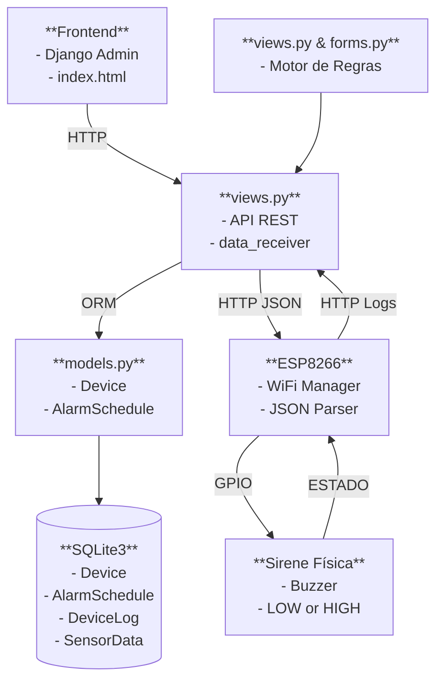
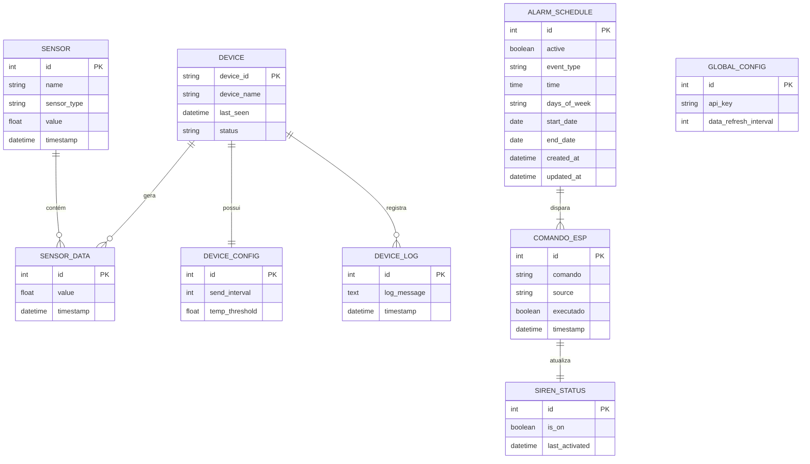
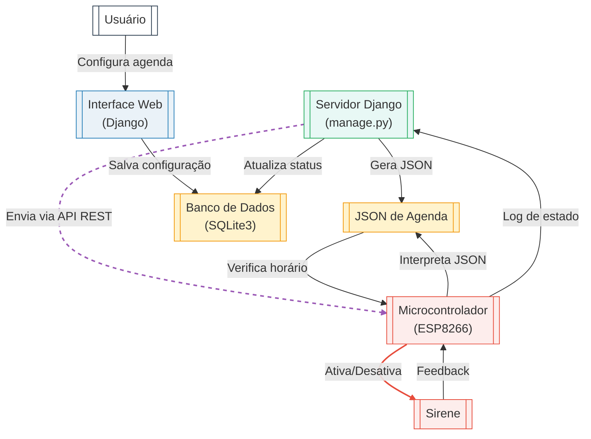

# 📣 Sistema de Sirene Escolar IoT

**Solução completa para automação de sirenes em instituições de ensino usando ESP8266 e Django**

---

## 📌 Índice

- [Visão Geral](#-visão-geral)
- [Tecnologias](#-tecnologias)
- [Arquitetura](#-arquitetura)
- [Instalação](#-instalação)
- [Configuração](#-configuração)
- [Uso](#-uso)
- [API](#-api)
- [Segurança](#-segurança)
- [Troubleshooting](#-troubleshooting)
- [Roadmap](#-roadmap)
- [Licença](#-licença)

---

## 🌐 Visão Geral

Sistema IoT para controle automatizado de sirenes escolares com:

- ✅ Agendamento inteligente (aulas, recreios, eventos)
- ✅ Ativação remota via interface web
- ✅ Sincronização horária via NTP
- ✅ Logs completos de operação
- ✅ Fail-safes para evitar ativações indevidas

---

## 🛠️ Tecnologias Utilizadas

| Componente | Tecnologias |
|------------|-------------|
| Backend    | Python 3.9+, Django 4.2, Django REST Framework, SQLite |
| Firmware   | C++ (Arduino Core), ESP8266HTTPClient, NTPClient, ArduinoJson |
| Frontend   | HTML5, Bootstrap 5, Chart.js (para gráficos de histórico) |
| Infra      | Gunicorn (produção), Nginx (proxy reverso), Raspberry Pi (opcional) |



---
## Banco de Dados



## 🏗️ Arquitetura do Sistema


---

## 📥 Instalação

### Pré-requisitos

- Python 3.9+
- Arduino IDE (para firmware)
- ESP8266 com WiFi

### Backend (Django)

```bash
git clone [repo_url]
cd sirene-escolar
pip install -r requirements.txt
python manage.py migrate
python manage.py createsuperuser
python manage.py runserver 0.0.0.0:8000
```

### Firmware (ESP8266)

1. Instale as bibliotecas no Arduino IDE:
   - ESP8266HTTPClient
   - NTPClient
   - ArduinoJson

2. Carregue `ESP8266_Code.cpp`

3. Configure `settings.h` com suas credenciais WiFi

---

## ⚙️ Configuração

### Arquivo `settings.py` (Django)

```python
# Configurações críticas
ALLOWED_HOSTS = ['*']  # Restrinja em produção!
TIME_ZONE = 'America/Sao_Paulo'
```

### Hardware

| Componente | Pino ESP8266 | Observações |
|------------|--------------|-------------|
| Sirene     | GPIO5 (D1)   | Relay ou transistor |
| LED Status | GPIO2 (D4)   | LED interno (invertido) |

---

## 🚀 Como Usar

### 1. Agendamentos

Acesse `http://localhost:8000/admin` e:

- Crie um novo `AlarmSchedule`
- Defina:
  - Tipo de evento (Aula, Recreio, etc.)
  - Horário e dias da semana
  - Período de validade

### 2. Ativação Manual

```bash
curl -X POST http://localhost:8000/ativar/   -H "Content-Type: application/json"   -d '{}'
```

### 3. Monitoramento

- **Serial Monitor**: Logs do ESP (115200 baud)
- **Admin Django**: Histórico em `DeviceLog`

---

## 📡 Documentação da API

| Endpoint           | Método | Parâmetros               | Resposta                |
|--------------------|--------|--------------------------|-------------------------|
| `/api/comando`     | GET    | -                        | JSON com agendamentos   |
| `/check_command/`  | GET    | -                        | `{"command": "ligar"}`  |
| `/confirm_command/`| POST   | `{"status": "success"}`  | -                       |
| `/api/sensor_data` | POST   | `{"value": 25.5, "type": "temp"}` | Log no banco de dados |

---

## 🔒 Segurança

### Medidas Atuais

- Timeout automático de 3s na sirene
- Verificação de duplicidade de comandos

### Recomendações para Produção

- Implementar HTTPS
- Adicionar autenticação JWT
- Restringir `ALLOWED_HOSTS`
- Usar PostgreSQL com criptografia

---

## 🐛 Troubleshooting

| Problema                 | Solução                        |
|--------------------------|--------------------------------|
| ESP não conecta ao WiFi  | Verificar credenciais e sinal  |
| Horário incorreto        | Checar servidor NTP e fuso horário |
| Sirene não desliga       | Testar circuito de potência/relay |
| API retorna 403          | Checar CSRF tokens ou CORS    |

---

## 🛣️ Roadmap e Ideias para Melhorias Futuras

- App móvel para notificações
- Integração com calendário acadêmico
- Dashboard com métricas em tempo real
- Suporte a múltiplas sirenes

---

## 📜 Licença

MIT License - Consulte o arquivo LICENSE para detalhes.

Documentação completa disponível em `/docs/`.
